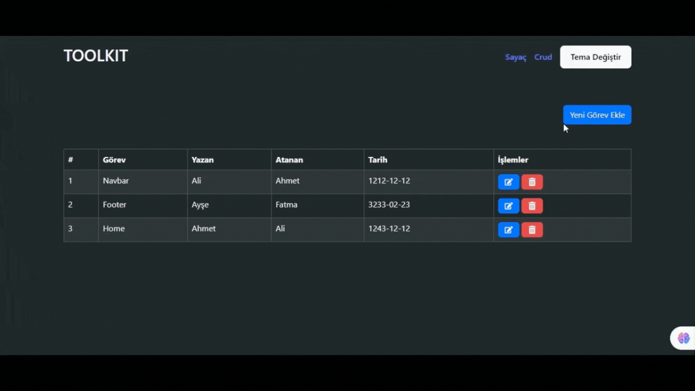

## Toolkit-Crud

Bu proje, CRUD (Create, Read, Update, Delete) işlemlerini gerçekleştirebileceğiniz bir Görev Yönetim Uygulamasıdır. Uygulama, kullanıcıların görev ekleyebildiği, mevcut görevleri düzenleyebildiği ve silebildiği bir platform sağlar. Ayrıca, kullanıcılar temayı açık ve koyu mod arasında değiştirebilirler.

## ScreenCast

